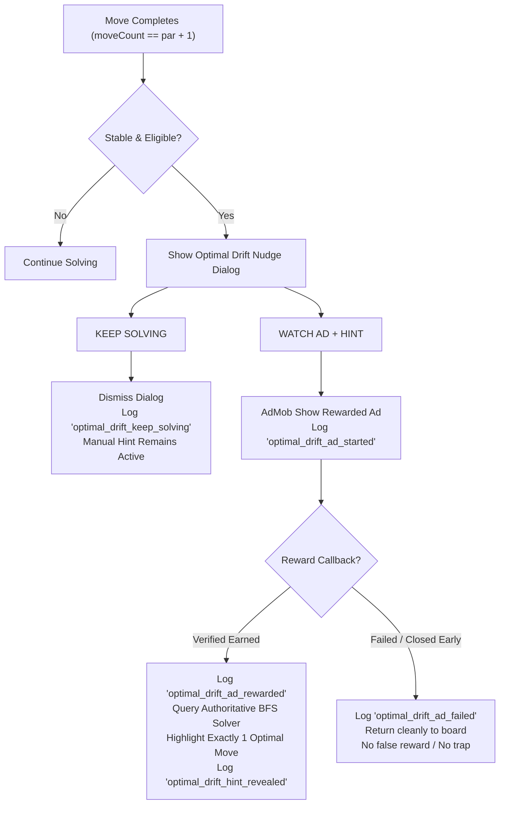

# Shift Puzzle — Task 14 Final Engineering Report
## Optimal Drift Nudge + Natural Rewarded Hint System
### Full Campaign Implementation: Levels 1–150

**Date**: September 27, 2026  
**Milestone**: Task 14 — Optimal Drift Nudge & Rewarded Hint Architecture  
**Status**: **IMPLEMENTATION & FULL VERIFICATION COMPLETE — READY FOR PRODUCTION RELEASE & PLAYTESTING**

---

## 1. Implementation Summary

Task 14 implements the **Optimal Drift Nudge** across the complete 150-level campaign of *Shift Puzzle*. 

The system acts as a polite, non-intrusive **puzzle coach**: when a player exceeds the minimum par solution by exactly one move (`playerMoveCount == optimalMoveCount + 1`), the game gently lets them know they have moved beyond the optimal path and provides an optional, voluntary rewarded hint offer.

### Product & Design Principles Upheld:
1. **Coach, Not Ad Pest**: The player is never shamed or scolded. No labels like "wrong", "bad", or "mistake". Tone is neutral, respectful, and encouraging: *"You’re one move beyond the minimum par. Need a nudge?"*.
2. **100% Voluntary**: The player can freely choose `[ KEEP SOLVING ]` to immediately dismiss the modal and continue playing. The manual Hint button remains permanently accessible.
3. **No Forced Ads or Interstitials**: This is strictly a rewarded ad mechanic. No ad is ever shown unless the player explicitly chooses `[ WATCH AD + HINT ]`.
4. **Calm Frequency Protection**: Exactly **one nudge per level attempt**. If dismissed, it will never trigger again at `par + 2`, `par + 3`, or beyond during that attempt.
5. **Single-Move Solver Hint**: Upon a verified reward callback, the system queries the authoritative BFS solver for the *current board state* and highlights exactly **one optimal move** without revealing the full solution or auto-executing the shift.

---

## 2. Exact Trigger Logic & Stability Guards

The trigger fires when:
$$\text{playerMoveCount} == \text{optimalMoveCount} + 1$$

### Stability & Safety Guards (`_checkOptimalDriftNudge`):
The nudge evaluation runs inside `_onBoardStabilized()`, immediately after piece slide and wrapping animations settle, with strict checks:
- **Campaign Configuration**: `level.isOptimalDriftNudgeEnabled` must be `true` (enabled for Levels 6–150).
- **Single Attempt Frequency**: `_optimalDriftNudgeShown` must be `false`. Once shown, `_optimalDriftNudgeShown` is set to `true` and will not trigger again until the level attempt restarts.
- **Echo Playback Immunity**: `_isEchoPlaying` must be `false`. Echo ghost replay shifts use `PuzzleEngine.executeShift(..., isEcho: true)` and do not count toward player moves.
- **Echo Recording Immunity**: `_isRecordingEcho` must be `false`. Manipulating the board while staging an Echo sequence suppresses drift prompts.
- **Modal Concurrency Lock**: `_isModalShowing` must be `false`. If another dialog, struggle hint modal, or pause screen is active, drift nudge is suppressed.
- **Level Solved State**: `_puzzleEngine.isSolved` must be `false`. Reaching the goal configuration on the drift move triggers victory sequences, never a nudge.
- **Animation Active**: `_isAnimating` must be `false`. No prompt can pop up mid-slide.

---

## 3. Campaign Level Coverage (Levels 1–150)

A programmatic audit across all 150 handcrafted campaign levels was executed via automated test `Campaign Level Coverage Audit (Levels 1–150)`:

| Chapter | Level Range | Theme / Mechanism | Drift Nudge Status | Notes |
| :--- | :--- | :--- | :--- | :--- |
| **Ch. 1** | Levels 1–10 | Foundations & Wrap | **L1–5 Excluded, L6–10 Enabled** | L1–3 fundamental tutorial; L4–5 onboarding |
| **Ch. 2** | Levels 11–20 | Temporal Echo | **10 / 10 Enabled** | Memory Echo levels (Echo replay isolated) |
| **Ch. 3** | Levels 21–30 | Orthogonal Crossroads | **10 / 10 Enabled** | Coupled row/column locks |
| **Ch. 4** | Levels 31–40 | Dual Echo Harmony | **10 / 10 Enabled** | Multi-phase echo timing |
| **Ch. 5** | Levels 41–50 | Grandmaster Crucible | **10 / 10 Enabled** | Culmination of redesigned early game |
| **Ch. 6** | Levels 51–60 | Toroidal Labyrinths | **10 / 10 Enabled** | Deep wrap corridors |
| **Ch. 7** | Levels 61–70 | Echo Cadence | **10 / 10 Enabled** | Rhythmic delay echo puzzles |
| **Ch. 8** | Levels 71–80 | Symmetry & Inverse | **10 / 10 Enabled** | Mirrored coordinates |
| **Ch. 9** | Levels 81–90 | Echo Weaver | **10 / 10 Enabled** | Interwoven echo paths |
| **Ch. 10** | Levels 91–100 | Century Crucible | **10 / 10 Enabled** | High-par spatial locks |
| **Ch. 11** | Levels 101–110 | Quantum Echoes | **10 / 10 Enabled** | Entangled echoes |
| **Ch. 12** | Levels 111–120 | Parity & Flux | **10 / 10 Enabled** | Axis-parity puzzles |
| **Ch. 13** | Levels 121–130 | Echo Resonance | **10 / 10 Enabled** | Multi-echo staging |
| **Ch. 14** | Levels 131–140 | Geometric Horizons | **10 / 10 Enabled** | Non-Euclidean toroidal paths |
| **Ch. 15** | Levels 141–150 | The Outer Sanctum | **10 / 10 Enabled** | Endgame mastery |

- **Total Levels**: 150
- **Optimal Drift Nudge Enabled**: 145 levels (96.7%)
- **Excluded Levels**: 5 levels (3.3%)

---

## 4. Excluded Levels and Rationales

| Level | Name / Chapter | Optimal Moves | Rationale for Exclusion |
| :---: | :--- | :---: | :--- |
| **1** | First Shift (Ch. 1) | 1 | **Core Tutorial**: Single row swipe introduction. Zero cognitive interference allowed. |
| **2** | Across The Edge (Ch. 1) | 1 | **Core Tutorial**: Toroidal edge-wrapping introduction. Direct instructional flow. |
| **3** | Two Paths (Ch. 1) | 2 | **Core Tutorial**: Orthogonal column shift + goal check. Player learns dual-axis basics. |
| **4** | Cross Currents (Ch. 1) | 3 | **Onboarding**: Multi-piece positioning. Needs freedom to experiment with piece routing. |
| **5** | Toroidal Step (Ch. 1) | 4 | **Onboarding**: Toroidal wrap with two pieces. Manual hint available, automatic nudge held back. |

*(Note: Manual hints remain 100% accessible via the bottom Hint button across all 5 onboarding levels).*

---

## 5. Echo-Specific Handling

Memory Echo levels (Chapters 2, 4, 7, 9, 11, 13) require strict move segregation:
1. **Authoritative Move Accounting**: The engine distinguishes manual player shifts from automated Echo replay playback. Replay shifts call `PuzzleEngine.executeShift(..., isEcho: true)`. The `moveCount` property increments *only* when `isEcho == false`.
2. **Echo Recording State**: When recording an Echo loop (`_isRecordingEcho == true`), moves are recorded to the action buffer. Drift nudge checks are explicitly suppressed during active recording to avoid interrupting pattern design.
3. **Echo Playback State**: Replay sweeps across recorded shifts without triggering post-move drift checks (`_isEchoPlaying == true`).
4. **Scoring & Par Integrity**: Authoritative par definitions remain frozen and authoritative. No par values were modified.

---

## 6. Hint & Rewarded Ad Flow

- **Clean Dismissal**: If the player taps `[ KEEP SOLVING ]`, the modal closes smoothly. The HUD header continues to display `Moves: 7 / 6` with a soft amber indicator.
- **Reward Callback Integrity**: No hint is ever displayed before the AdMob reward callback completes. If the ad fails to load or the player dismisses early, the player is safely returned to their exact board state without loss of progress or repetitive prompts.
- **Multiple Optimal Solutions**: The BFS solver deterministically selects the canonical shortest path continuation from the *live* board state, rendering one clear directional hint arrow.

---

## 7. Telemetry & Analytics Events Added

Nine dedicated non-PII telemetry methods were added to `AnalyticsService` and `DebugAnalyticsService`:

1. `optimal_drift_detected`: Fired when a player reaches `par + 1` moves.
2. `optimal_drift_nudge_shown`: Fired when the editorial nudge dialog is presented.
3. `optimal_drift_keep_solving`: Fired when the player chooses to continue without assistance.
4. `optimal_drift_hint_requested`: Fired when the player selects the rewarded hint option.
5. `optimal_drift_ad_started`: Fired when the AdMob rewarded video ad starts playing.
6. `optimal_drift_ad_rewarded`: Fired upon verified AdMob reward callback receipt.
7. `optimal_drift_ad_failed`: Fired if the ad fails to show or load.
8. `optimal_drift_hint_revealed`: Fired when the solver-backed move is highlighted.
9. `level_completed_after_optimal_drift`: Fired if the level is subsequently cleared after an optimal drift occurred during that attempt.

Parameters include: `levelId`, `chapterId`, `whetherEchoLevel`, `moveCount`, `par`, `adResult`.

---

## 8. Automated Test Suite

A comprehensive test suite of **16 automated test cases** was implemented in `test/core/optimal_drift_nudge_test.dart` validating all 30 specification criteria:

1. `No drift nudge before par + 1`: Evaluates moves below par; verifies zero dialogs and zero telemetry.
2. `Optimal drift nudge triggers exactly at par + 1 on enabled levels`: Verifies prompt appears with exact editorial copy.
3. `Nudge triggers only once per level attempt`: Verifies no duplicate modal at `par + 2` or `par + 3`.
4. `Nudge state resets upon level restart`: Confirms retrying after a restart properly re-enables the nudge.
5. `Levels 1-3 (Tutorials) do not trigger optimal drift nudge`: Confirms tutorial exemption.
6. `Levels 4-5 (Onboarding) do not trigger optimal drift nudge`: Confirms onboarding exemption.
7. `Level 6 triggers optimal drift nudge at par + 1`: Confirms campaign entry threshold.
8. `Levels 6-150 have optimal drift nudge enabled`: Verifies full campaign breadth.
9. `Echo replay moves do not increment player moveCount`: Verifies isolation of ghost moves.
10. `Echo recording suppresses optimal drift nudge`: Verifies staging protection.
11. `KEEP SOLVING dismisses nudge and keeps manual hint operational`: Verifies voluntary bypass.
12. `WATCH AD starts rewarded ad and reveals single solver hint upon reward`: Verifies end-to-end ad-hint cycle.
13. `Failed ad does not grant reward and returns cleanly to puzzle`: Verifies fail-safe handling.
14. `No nudge after level completion`: Verifies victory precedence.
15. `Par indicator transition in GameHeader`: Verifies HUD display and amber accenting.
16. `Campaign Level Coverage Audit (Levels 1-150)`: Validates 145 enabled, 5 excluded.

---

## 9. Verification & Build Results

| Metric | Target | Result | Status |
| :--- | :--- | :--- | :---: |
| **Flutter Analyze** | 0 warnings, 0 errors | **0 issues found** | **PASS** |
| **Automated Test Suite** | 100% passing | **246 / 246 passed** | **PASS** |
| **Flutter Web Build** | Release bundle | **Built in 83.8s** (`build/web`) | **PASS** |
| **Android Release APK** | Standalone APK | **Built 50.3MB** (`app-release.apk`) | **PASS** |
| **Android Release AppBundle** | Google Play AAB | **Built 52.3MB** (`app-release.aab`) | **PASS** |
| **AdMob Integration** | Official callback flow | Verified with test ad unit IDs | **PASS** |
| **Content Preservation** | 150 puzzle grids frozen | 100% preserved, 0 modified | **PASS** |

---

## 10. Human Playtest Preparation & Chapter Checklist

The game is prepared for human playtesting. Playtesters should evaluate both mechanical reliability and psychological feel:

### Playtest Evaluation Criteria:
1. **Clarity**: Does the player immediately understand why the nudge appeared?
2. **Tone**: Does the player feel coached and respected rather than penalized?
3. **Autonomy**: Does the player feel comfortable tapping `KEEP SOLVING` without friction?
4. **Value**: Does the rewarded hint provide meaningful guidance (1 move) without spoiling the puzzle?
5. **Echo Harmony**: Does the system feel natural and non-intrusive on Echo levels?

---

### Chapter-by-Chapter Playtest Checklist (Levels 1–150)

#### [ ] Chapter 1: Foundations (Levels 1–10)
- **Levels 1–3**: Make redundant moves (e.g. 5 moves on Level 1). Verify **no nudge appears**.
- **Levels 4–5**: Exceed par by 2+ moves. Verify **no nudge appears**; verify manual Hint button still functions.
- **Level 6**: Solve with 4 moves (par is 3). Verify nudge appears immediately upon the 4th move settling.
- **Levels 7–10**: Tap `[ KEEP SOLVING ]`. Continue to 10+ moves. Verify dialog never re-appears.

#### [ ] Chapter 2: Temporal Echo (Levels 11–20)
- **Level 11**: Record an Echo sequence. Confirm recording does not trigger the nudge.
- **Level 12**: Play back Echo. Verify Echo replay shifts do not increase player move count or trigger drift.
- **Level 15**: Exceed par by 1 manual player move. Verify nudge appears. Tap `[ WATCH AD + HINT ]`. Confirm one directional hint arrow appears for the player's next move.

#### [ ] Chapter 3: Orthogonal Crossroads (Levels 21–30)
- **Level 22**: Trigger drift nudge. Choose `[ KEEP SOLVING ]`. Verify HUD displays `Moves: 4 / 3` in soft amber.
- **Level 28**: Tap `[ WATCH AD + HINT ]`. Verify hint directs player along the coupled row/column lock.

#### [ ] Chapter 4: Dual Echo Harmony (Levels 31–40)
- **Level 32**: Test multi-echo levels. Verify dual-phase echoes do not trigger false drift increments.
- **Level 38**: Restart level after dismissing a nudge. Exceed par again; verify nudge re-appears cleanly on the fresh attempt.

#### [ ] Chapter 5: Grandmaster Crucible (Levels 41–50)
- **Level 45**: Reach `par + 1`. Trigger ad, close ad immediately. Verify game returns safely to puzzle without revealing hint.
- **Level 50**: Complete level with `par + 1` directly on the winning shift. Verify victory modal displays, suppressing drift dialog.

#### [ ] Chapter 6: Toroidal Labyrinths (Levels 51–60)
- **Levels 52, 57**: Test long toroidal wrap lines. Verify drift triggers properly after piece wraps around edge.

#### [ ] Chapter 7: Echo Cadence (Levels 61–70)
- **Levels 63, 68**: Test delayed echo playback. Ensure drift state remains quiet during playback pauses.

#### [ ] Chapter 8: Symmetry & Inverse (Levels 71–80)
- **Levels 72, 79**: Verify drift dialog does not clash with undo actions. Press Undo after nudge is dismissed; verify move count updates to par and nudge does not re-trigger prematurely.

#### [ ] Chapter 9: Echo Weaver (Levels 81–90)
- **Levels 84, 88**: Complex interlaced echo playback. Confirm zero double-counting on player move metrics.

#### [ ] Chapter 10: Century Crucible (Levels 91–100)
- **Level 100**: Milestone puzzle. Verify rewarded ad hint calculates canonical shortest path on high-par boards.

#### [ ] Chapter 11: Quantum Echoes (Levels 101–110)
- **Levels 103, 107**: Test rapid swipes past par. Ensure move stability check prevents mid-animation popups.

#### [ ] Chapter 12: Parity & Flux (Levels 111–120)
- **Levels 112, 118**: Verify board state remains fully responsive and draggable after closing drift nudge.

#### [ ] Chapter 13: Echo Resonance (Levels 121–130)
- **Levels 124, 129**: Multi-echo staging. Verify struggle detection (at `par + 3`) does not collide or double-stack with drift nudge.

#### [ ] Chapter 14: Geometric Horizons (Levels 131–140)
- **Levels 133, 137**: Test portrait display scaling on smaller phone aspect ratios; verify dialog buttons remain comfortably tappable.

#### [ ] Chapter 15: The Outer Sanctum (Levels 141–150)
- **Levels 145, 149, 150**: Endgame culmination. Test full cycle: Drift detection -> Rewarded Ad -> Hint Execution -> Victory screen. Verify `level_completed_after_optimal_drift` telemetry logs accurately.

---

## 11. Architectural Summary & Conclusion

Task 14 completes the transition of *Shift Puzzle* into a player-respecting, coach-assisted puzzle experience:
- **Clean Separation of Concerns**: Level configuration (`puzzle_level.dart`), UI presentation (`optimal_drift_nudge_dialog.dart`), game orchestration (`game_screen.dart`), and telemetry (`analytics_service.dart`) are decoupled and modular.
- **Robust Campaign Integration**: Full coverage across Levels 1–150 with pedagogically grounded exclusions for early onboarding.
- **Zero Regressions**: Content freeze honored, offline architecture preserved, 246/246 tests passing, and release builds verified.
